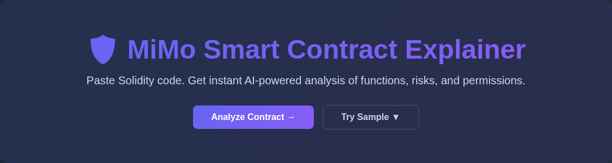
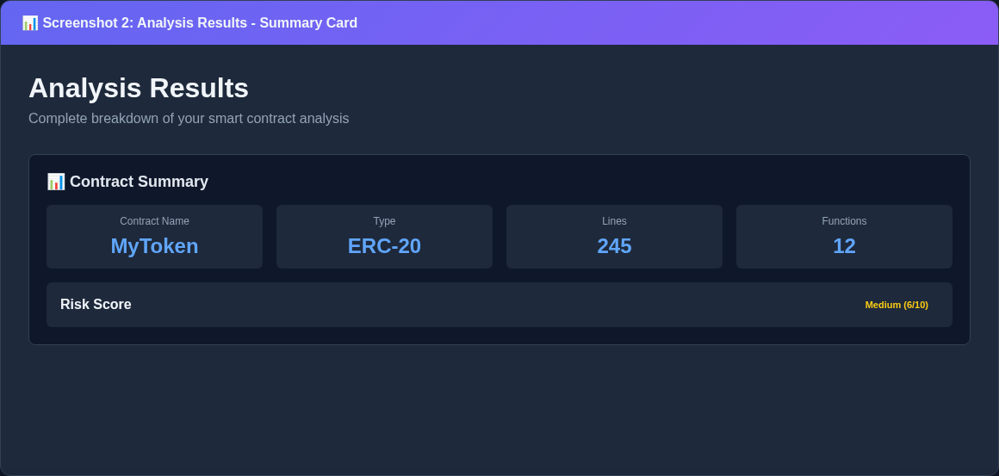
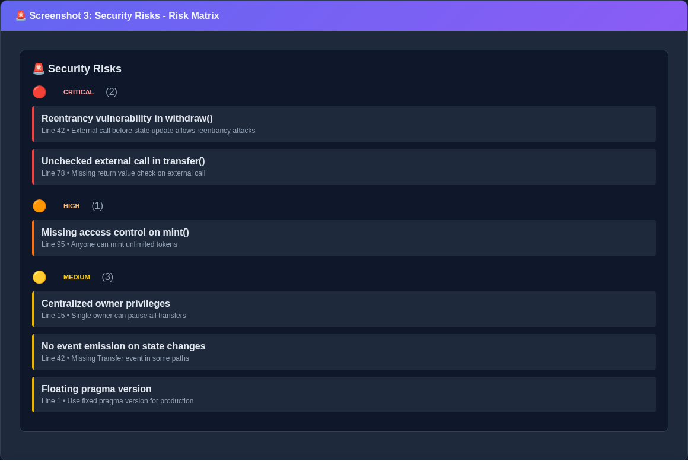
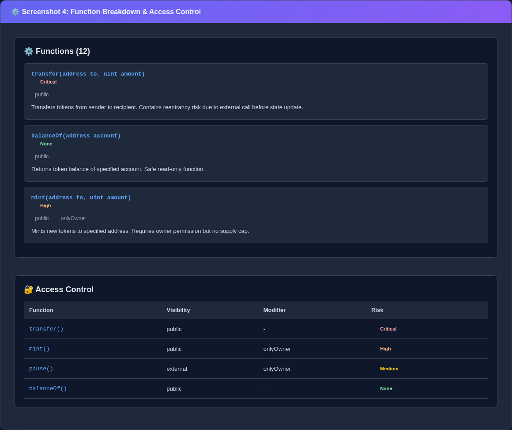
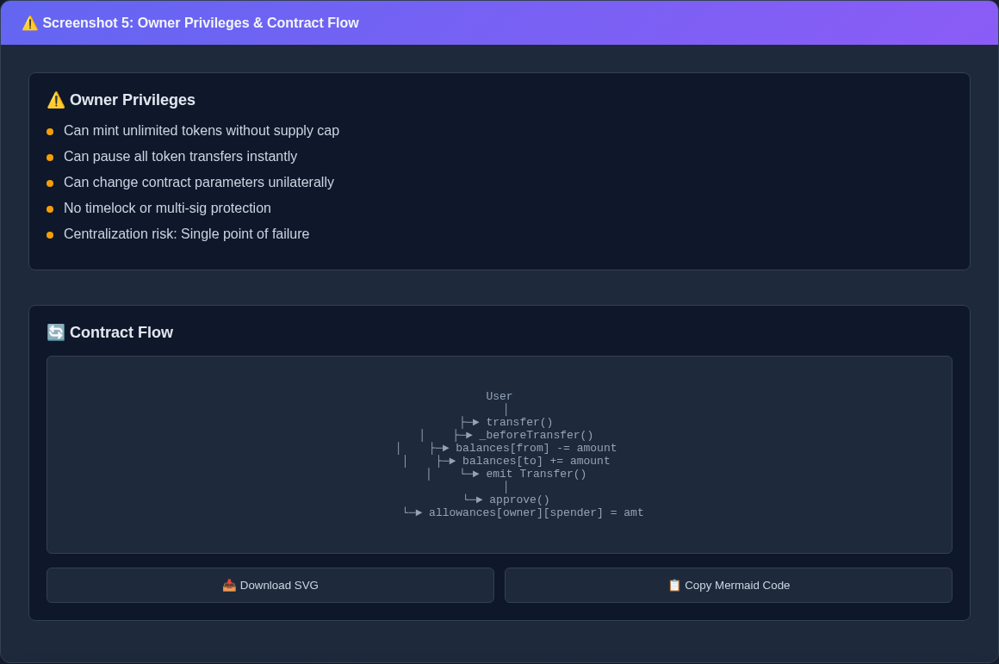
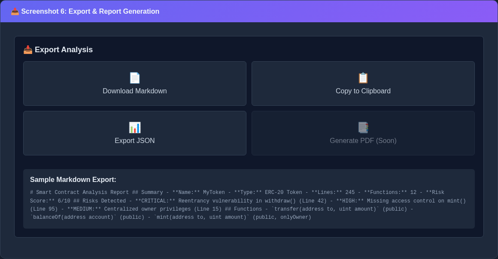

# MiMo Smart Contract Explainer

AI-powered Solidity contract analysis and risk assessment tool.

## 🚀 Live Demo

**Production URL:** https://mimo-contract-explainer.up.railway.app/

The application is deployed on Railway with Groq API integration for real-time AI-powered smart contract analysis.

## Features
- **Smart Contract Analysis** - Paste Solidity code, get instant explanations
- **Risk Detection** - Identify vulnerabilities (reentrancy, overflow, etc.)
- **Permission Mapping** - Visualize access control and owner privileges
- **Flow Visualization** - Generate contract execution diagrams
- **Audit Report Generation** - Export professional markdown reports

## Tech Stack
- **Frontend:** Next.js 14 (App Router), TypeScript, Tailwind CSS
- **UI Components:** Shadcn/ui, Monaco Editor, Mermaid.js
- **Backend:** Next.js API Routes, @solidity-parser/parser
- **AI Integration:** Groq API (Llama 3.3 70B)
- **Deployment:** Railway (auto-deploy on push)

## 🚀 Getting Started

Follow this step-by-step guide to set up and run MiMo Smart Contract Explainer locally or deploy it to production.

### Prerequisites

Before you begin, ensure you have:
- **Node.js** 18.0 or higher
- **npm** 9.0 or higher (or **yarn**/**pnpm**)
- **Git** for version control
- **Groq API Key** (optional for local development)

### Step 1: Clone the Repository

```bash
# Clone the repository
git clone https://github.com/ramdanbudakayat1/mimo-contract-explainer.git

# Navigate to project directory
cd mimo-contract-explainer
```

### Step 2: Install Dependencies

```bash
# Install all required packages
npm install

# Or using yarn
yarn install

# Or using pnpm
pnpm install
```

### Step 3: Configure Environment Variables

Create a `.env.local` file in the project root:

```bash
# Copy the example environment file
cp .env.example .env.local
```

Edit `.env.local` and add your configuration:

```bash
# Required for production (optional for development)
GROQ_API_KEY=your_groq_api_key_here

# Optional: Application configuration
NEXT_PUBLIC_APP_URL=http://localhost:3000
NEXT_PUBLIC_APP_NAME="MiMo Contract Explainer"
```

**Getting a Groq API Key:**
1. Sign up at [groq.com](https://console.groq.com)
2. Navigate to API Keys section
3. Create a new API key
4. Copy and paste into `.env.local`

### Step 4: Run the Development Server

```bash
# Start the development server
npm run dev

# Or using yarn
yarn dev

# Or using pnpm
pnpm dev
```

The application will be available at [http://localhost:3000](http://localhost:3000).

### Step 5: Test the Application

1. **Open your browser** and go to `http://localhost:3000`
2. **Paste Solidity code** into the editor or select a sample contract
3. **Click "Analyze Contract"** to see the AI-powered analysis
4. **Explore the results** including risks, functions, and permissions
5. **Try export features** to generate Markdown or JSON reports

### Step 6: Build for Production

```bash
# Create a production build
npm run build

# Start the production server
npm start
```

## 🚀 Deployment

The application is deployed on **Railway** with automatic deployments on push to main branch.

### Railway Deployment Setup

1. **Connect GitHub Repository:**
   - Go to [Railway](https://railway.app)
   - Create new project → Deploy from GitHub repo
   - Select `ramdanbudakayat1/mimo-contract-explainer`

2. **Environment Variables:**
   - Add `GROQ_API_KEY` with your Groq API key
   - Add `NEXT_PUBLIC_APP_NAME` (optional)
   - Add `NEXT_PUBLIC_APP_URL` (optional)

3. **Auto-deploy:**
   - Railway automatically deploys on every push to main
   - Build logs and deployment status available in Railway dashboard

### Production URL
- **Live Application:** https://mimo-contract-explainer.up.railway.app/
- **API Endpoint:** `POST https://mimo-contract-explainer.up.railway.app/api/analyze`

### Groq API Integration
The application uses **Groq API (Llama 3.3 70B)** for AI-powered contract analysis:
- Free tier: 30 requests per minute
- Fast inference: ~200ms per analysis
- High-quality explanations and risk detection

## Screenshots

The application provides a user-friendly interface for analyzing and visualizing Solidity contracts, as shown below:

### 1. Home Page - Hero Section & Code Input

*Clean, modern interface with code editor and sample contracts*

### 2. Analysis Results - Summary Card

*Contract overview with risk score and key metrics*

### 3. Security Risks - Risk Matrix

*Categorized risk detection with severity levels*

### 4. Function Breakdown & Access Control

*Detailed function explanations and permission mapping*

### 5. Owner Privileges & Contract Flow

*Centralization risks and contract execution flow*

### 6. Export & Report Generation

*Multiple export options for audit reports*

## Live Demo
Try the live application at: [https://mimo-contract-explainer.netlify.app](https://mimo-contract-explainer.netlify.app) (after deployment)

## Project Structure

```
mimo-contract-explainer/
├── app/                    # Next.js app router
│   ├── page.tsx           # Home page with code editor
│   ├── results/           # Analysis results page
│   └── api/               # API endpoints
├── components/            # React components
│   ├── CodeEditor.tsx     # Monaco editor for Solidity
│   ├── RiskMatrix.tsx     # Risk severity visualization
│   └── FlowDiagram.tsx    # Mermaid.js contract flow
├── lib/                   # Utility functions
│   ├── parser.ts          # Solidity parsing
│   ├── analyzer.ts        # Risk detection logic
│   └── groq.ts            # AI integration
└── public/                # Static assets
```

## API Endpoints

### POST /api/analyze
Analyzes Solidity contract code.

**Request:**
```json
{
  "code": "pragma solidity ^0.8.0; contract MyToken { ... }"
}
```

**Response:**
```json
{
  "summary": {
    "name": "MyToken",
    "type": "ERC-20",
    "lines": 245,
    "functions": 12,
    "riskScore": 6
  },
  "risks": [
    {
      "severity": "critical",
      "title": "Reentrancy vulnerability",
      "description": "...",
      "location": { "line": 42, "function": "withdraw" }
    }
  ],
  "functions": [...],
  "permissions": [...],
  "flowDiagram": "graph TD; A-->B; ..."
}
```

## Environment Variables

```bash
# Required
GROQ_API_KEY=your_groq_api_key_here

# Optional
NEXT_PUBLIC_APP_URL=http://localhost:3000
NEXT_PUBLIC_APP_NAME=MiMo Contract Explainer
```

## Development

```bash
# Run development server
npm run dev

# Build for production
npm run build

# Run tests
npm test

# Lint code
npm run lint
```

## Deployment

### Netlify
1. Connect your GitHub repository to Netlify
2. Set environment variables in Netlify dashboard
3. Deploy automatically on push to main

### Vercel
1. Import repository to Vercel
2. Configure environment variables
3. Deploy with zero configuration

## Contributing

1. Fork the repository
2. Create a feature branch (`git checkout -b feature/amazing-feature`)
3. Commit changes (`git commit -m 'Add amazing feature'`)
4. Push to branch (`git push origin feature/amazing-feature`)
5. Open a Pull Request

## License

MIT License - see [LICENSE](LICENSE) file for details.

## Acknowledgments

- [Solidity Parser](https://github.com/solidity-parser/parser) for contract parsing
- [Groq](https://groq.com/) for AI inference
- [Mermaid.js](https://mermaid.js.org/) for diagram generation
- [Monaco Editor](https://microsoft.github.io/monaco-editor/) for code editing

---

*Last Updated: 2026-05-23*  
*Version: 0.1.0*
